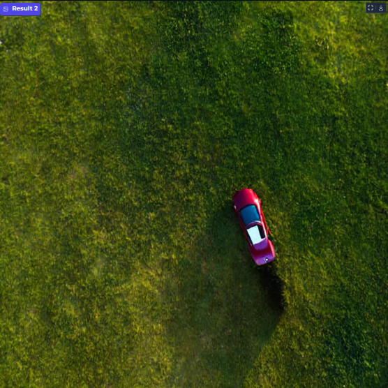
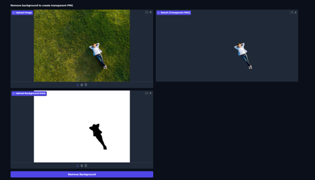

# CustomPix

CustomPix is a comprehensive image editing and manipulation toolkit that combines the power of AI-driven segmentation, inpainting, and style transfer with traditional computer vision techniques. Built with a user-friendly Gradio interface, it provides professional-grade image editing capabilities using state of the art models, accessible to both beginners and advanced users.

## Main Technologies Used

- **Segment Anything Model (SAM)** - For precise object segmentation using bounding box coordinates
- **Stable Diffusion XL (SDXL) Inpainting Model** - Inpainting model for intelligent object and background editing
- **TensorFlow Hub** - Arbitrary image stylization for artistic style transfer
- **OpenCV** - Traditional computer vision operations for coloring and background removal
- **Gradio** - Interactive web interface for seamless user experience
- **Diffusers Library** - Hugging Face diffusion models integration

## Features

### 1. Segment Anything Model(SAM) Based Mask Creation
- Interactive bounding box selection for precise object segmentation
- Real-time mask visualization and preview
- Downloadable masks for external use and further processing

### 2. Background Mask Generation
- Automatic background mask creation from foreground object masks
- Inverse mask generation for background-focused editing
- Convenient download option for background manipulation workflows

### 3. SDXL Inpainting Editor
- **Manual Mask Drawing**: Freehand mask creation with brush tools
- **Mask Upload**: Use pre-generated SAM masks for consistent editing
- **Intelligent Editing**: Add, modify, or remove objects using text prompts
- **Negative Prompts**: Fine-tune results by specifying what to avoid
- **Background Editing**: Seamlessly modify backgrounds while preserving foreground objects

### 4. Neural Style Transfer
- Artistic style transfer using Google's Magenta model
- Upload source image and reference style image
- Preserves content structure while applying artistic styles

### 5. Selective Coloring
- Precision color application using OpenCV
- Mask-based color targeting for specific regions
- RGB value control with intensity adjustment

### 6. Background Removal
- Clean background removal to create transparent PNGs

## Examples

### SAM Mask Creation Interface

### Background Mask Generation

### SDXL Inpainting Results

### Style Transfer

### Selective Coloring

### Background Removal

## Steps to Run

### Google Colab
1. Clone the repository and upload the repository files to your Colab environment
2. Run all cells to install dependencies and launch the interface

## Future Enhancements

- **Object Generation**: AI-powered object insertion and creation within images
- **Image Deblurring**: Advanced algorithms for motion and focus blur removal
- **Super Resolution**: Upscaling capabilities for image enhancement
- **Advanced Filters**: Additional artistic and technical filters
- **API Endpoints**: RESTful API for integration with other applications
- **Custom Model Training**: Fine-tuning capabilities for specific use cases

## Acknowledgments
- Meta AI for the Segment Anything Model
- Stability AI for Stable Diffusion XL
- Google Magenta for the style transfer model
- Hugging Face for the diffusion models ecosystem
- OpenCV community for computer vision tools